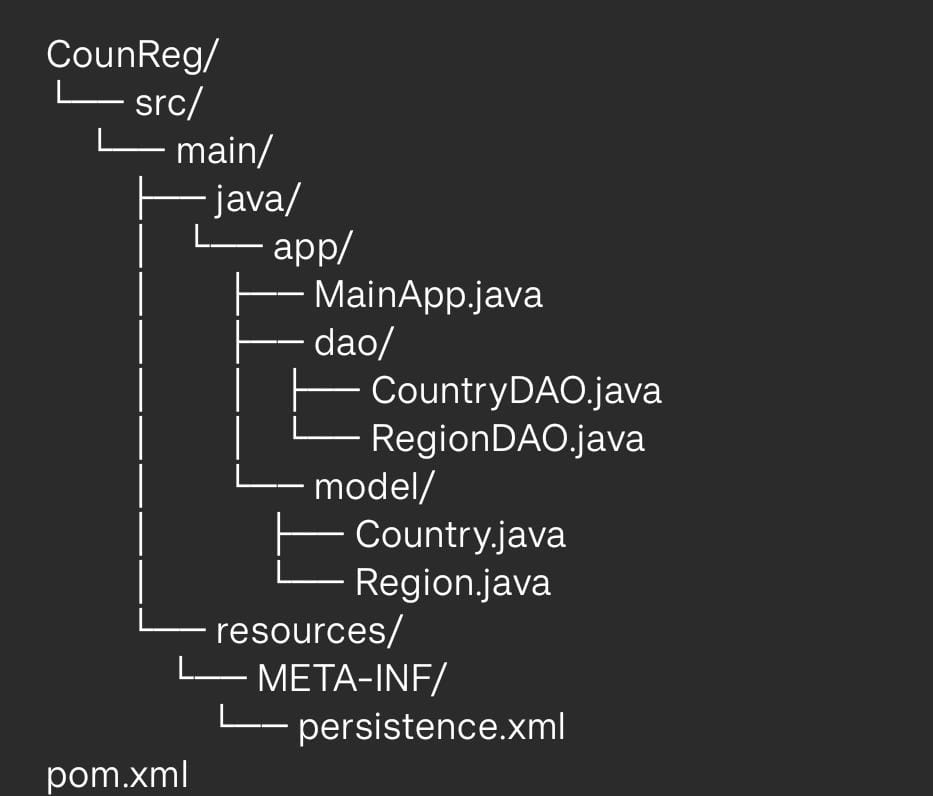
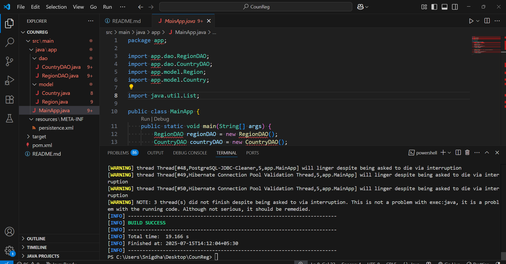

# 🌍 Country & Region Management System

A simple Java-based system to manage and track countries and their respective regions using Hibernate (JPA) & PostgreSQL 🗺️✨.

---

# 🚀 Features

- 🌐 Add new Region  
- 🇮🇳 Add new Country with Region link  
- 📋 View saved data directly from PostgreSQL  
- 🗃️ Tables auto-created by Hibernate  
- ☕ Built with Java + Maven  

---

# 🛠️ Technologies Used

- ✅ Java (Core)  
- ✅ Hibernate (JPA)  
- ✅ PostgreSQL  
- ✅ Maven  

---

# 🧪 How to Run

# 1️⃣ Install PostgreSQL

- Create a database named: countrydb  
- Tables will be auto-created.

# sql

CREATE TABLE regions (
    region_id SERIAL PRIMARY KEY,
    region_name VARCHAR(25)
);

CREATE TABLE countries (
    country_id CHAR(2) PRIMARY KEY,
    country_name VARCHAR(40),
    region_id INT NOT NULL,
    FOREIGN KEY (region_id) REFERENCES regions(region_id)
        ON DELETE CASCADE ON UPDATE CASCADE
);

---

2️⃣ Setup Project and Folder Structure

Open the project folder in VS Code or IntelliJ
Ensure pom.xml has Hibernate & PostgreSQL dependencies
Folder structure should look like:

---

3️⃣ Configure Database Connection

In persistence.xml, update with your local credentials:

<property name="jakarta.persistence.jdbc.url" value="jdbc:postgresql://localhost:5432/countrydb"/>
<property name="jakarta.persistence.jdbc.user" value="postgres"/>
<property name="jakarta.persistence.jdbc.password" value="your_password"/>
<property name="jakarta.persistence.jdbc.driver" value="org.postgresql.Driver"/>

---

4️⃣ Compile & Run the App

Open terminal inside the project folder and run:

mvn clean compile
mvn exec:java

---

📸 Sample Output

🌐 Region Added: Asia
🇮🇳 Country Added: India
🇯🇵 Country Added: Japan

# You can also check in pgAdmin:

SELECT * FROM regions;
SELECT * FROM countries;

---

👩‍💻 Author

Name: Snigdha Kandikatla
